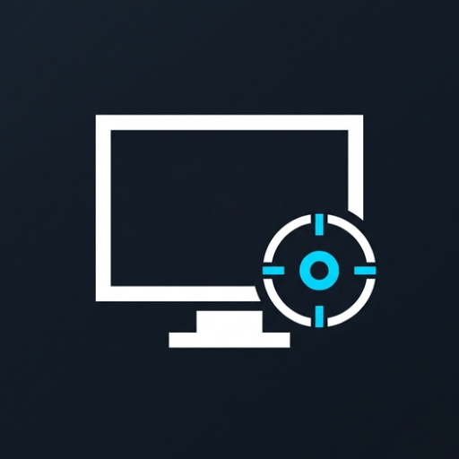

<div align="center">

  
  <br/><br/>

  <h1>WinStudio</h1>

  <p><strong>Record your screen. Get a polished demo. No editing required.</strong></p>

  <p><em>Native Windows screen recorder focused on fast capture, auto-zoom,<br/>and clean processed output.</em></p>

  <br/>

  [](https://dotnet.microsoft.com/)
  [](https://learn.microsoft.com/en-us/windows/apps/winui/winui3/)
  [](https://learn.microsoft.com/en-us/windows/apps/windows-app-sdk/)
  [](https://ffmpeg.org/)
  [](https://www.microsoft.com/windows)

  <a href="#overview">Overview</a> |
  <a href="#getting-started">Getting Started</a> |
  <a href="#features">Features</a> |
  <a href="#roadmap">Roadmap</a> |
  <a href="#tech-stack">Tech Stack</a> |
  <a href="#contributing">Contributing</a>

  

  

  


</div>

## Overview

WinStudio is a native Windows desktop app for recording a window or monitor and turning it
into a processed demo video with automatic zoom behavior.

The current MVP is centered on the recording flow: choose a target, record, stop, process,
and review the output files.

---

## Getting Started

### Install

- Windows 10 or Windows 11
- .NET 8 SDK
- FFmpeg installed and available on `PATH`
- Windows App SDK runtime
- Visual Studio 2022 is optional for development

Need setup help or install steps? See [INSTALLATION_GUIDE.md](./INSTALLATION_GUIDE.md).

### Run locally

Clone the repo first:

```powershell
git clone <repo-url>
cd WinStudio
```

From the repository root:

```powershell
dotnet restore WinStudio.sln
dotnet build WinStudio.sln -c Debug
dotnet run --project src/WinStudio.App/WinStudio.App.csproj -c Debug
```

Outputs are written to `C:\Users\<you>\Videos\WinStudio`.

### Test

```powershell
dotnet test WinStudio.sln -c Debug
dotnet test tests/WinStudio.Processing.Tests/WinStudio.Processing.Tests.csproj -c Debug
dotnet test tests/WinStudio.Export.Tests/WinStudio.Export.Tests.csproj -c Debug
```

---

## Features

- [](./src/WinStudio.App) Native WinUI 3 recording flow with target selection before capture.
- [](./src/WinStudio.App) Compact recording toolbar for start, stop, and pause actions during capture.
- [](./src/WinStudio.Processing) Processed video zoom reacts to cursor, clicks, drag selection, scroll, and keyboard activity.
- [](./src/WinStudio.App) Pre-record controls for zoom intensity, zoom sensitivity, and follow speed.
- [](./src/WinStudio.App) Optional system audio capture in the current MVP flow.
- [](./src/WinStudio.App) Every session writes a raw MP4, processed MP4, cursor JSON, zoom JSON, and FFmpeg logs.
- [](./src/WinStudio.App) Results page for opening outputs and starting a new recording quickly.

---

## Roadmap

- Stabilize cursor-centered zoom so follow behavior is smoother during clicks, drag selection, and typing.
- Wire the existing editor layer into the app for trim and timeline interactions.
- Expand export options beyond the current processed MP4 flow.
- Add microphone capture after the recording pipeline is stable.

---

## Tech Stack

**App**

[](https://dotnet.microsoft.com/)
[](https://learn.microsoft.com/en-us/windows/apps/winui/winui3/)
[](https://learn.microsoft.com/en-us/windows/apps/windows-app-sdk/)

**Capture and Processing**

[](https://ffmpeg.org/)
[](./src/WinStudio.App)
[](./src/WinStudio.Processing)

**Testing**

[](./tests)
[](./tests)

---

## Contributing

Contributions should stay focused and verifiable.

- Create a focused branch or PR for one change set
- Run `dotnet build WinStudio.sln -c Debug` before opening a PR
- Run targeted tests while working, then `dotnet test WinStudio.sln -c Debug`
- Include purpose, key changes, test evidence, and screenshots or short recordings for UI work

If you change recording or processing behavior, include the exact test command you ran and
note any output artifacts you inspected.

---

<div align="center">
  <br/>
  <p><em>"Thank you"</em></p>
</div>
